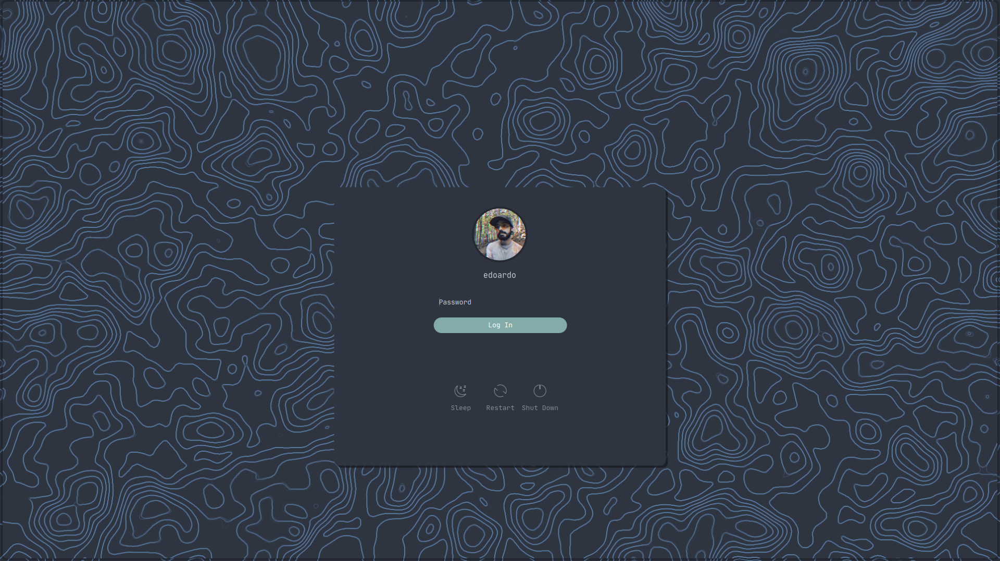
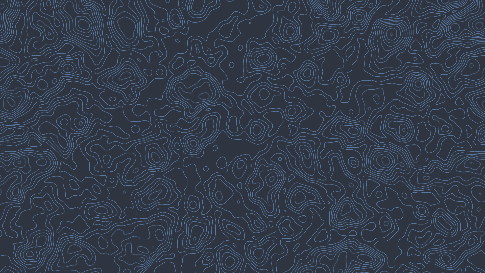

# Nord SDDM Login Screen

This is my custom login screen based on the Nord colorscheme

This version does not have the shadow around the Login Rectangle (as you can see in the screenshot below)

# Installation
- Move the folder `Nord` in the sddm themes folder

```bash
sudo cp -R Nord /usr/share/sddm/themes/
```

- Edit sddm config to use the new theme

```bash
/usr/lib/sddm/sddm.conf.d/default.conf
```

and in the section `[Theme]` change the value `Current=...` to be `Current=Nord`

# Test Theme
To test the theme without having to logout everytime just use

```bash
sddm-greeter --test-mode --theme Nord
```


# User Icon outside of KDE

If you are using a window manager like bspwm and want to show a user icon at login just take a picture and move it to `/usr/share/sddm/faces/username.face.icon`

> replace username with your own one

# Screenshots


# Wallpaper
